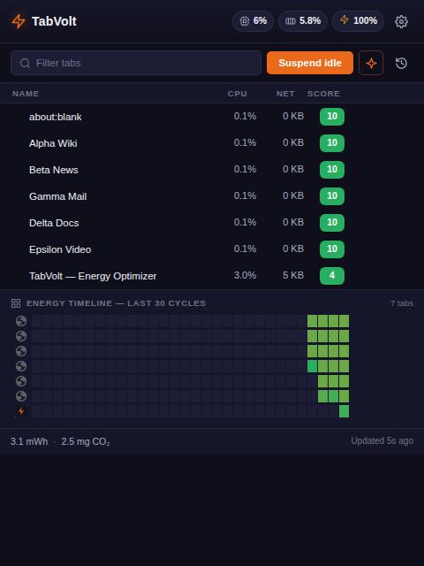
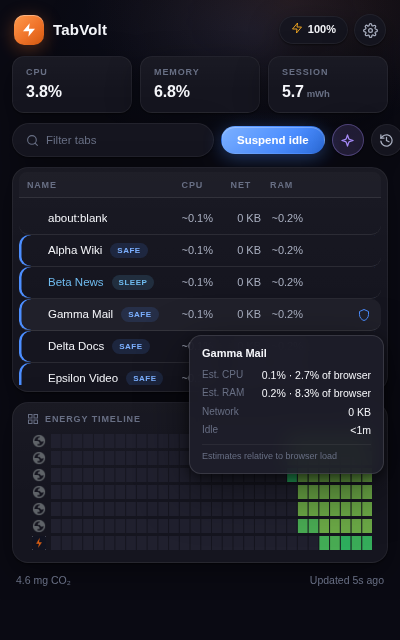
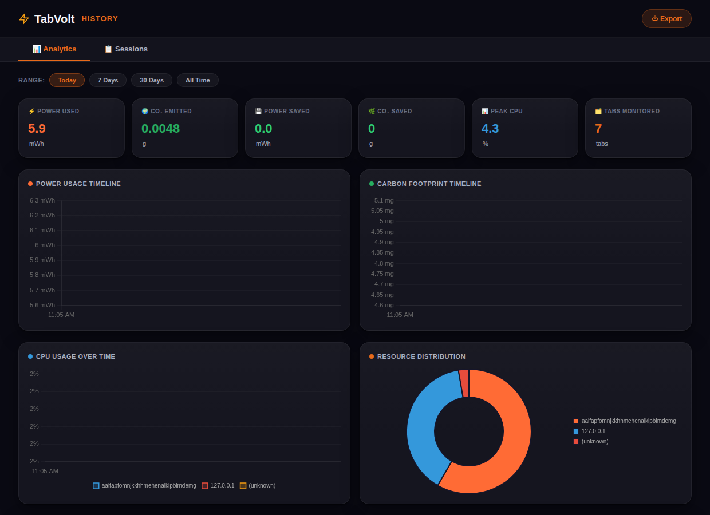

# TabVolt ⚡🌍

**TabVolt** is a per-tab energy intelligence Chrome extension. It monitors, ranks, and visualizes the energy and carbon footprint of your browsing in real time — a task manager for tab energy — helping you reclaim system resources and reduce your environmental impact.

| Live tab table | Sleep / protect + tooltip | Analytics |
|---|---|---|
|  |  |  |

## ✨ Features

- **Per-tab energy scoring** — a normalized 0–100 Energy Score for every open tab, weighted across estimated CPU share (55%), network activity (20%), idle time (15%), and background state (10%).
- **Task-manager UI** — a sortable, searchable live table of every tab (CPU / network / RAM columns), updated in place with zero flicker, with per-row actions: suspend, pause animations, protect. CPU and RAM are clearly marked (`~`) as relative estimates, not exact measurements — see **Accuracy** below for why. The composite energy score keeps driving Suspend Idle, the heatmap, and AI ranking behind the scenes even though it's no longer its own column.
- **Real battery awareness** — battery level and charging state are read via an offscreen document (the Battery Status API isn't available to MV3 service workers) and drive:
  - **Adaptive polling** — 5 s when plugged in, degrading to 20 s on critical battery, so TabVolt never becomes the drain it measures.
  - **Energy Budget mode** — "keep my battery above 30% until 18:00"; TabVolt projects your drain rate and suspends the worst offenders when you're off track.
  - **Battery-critical protection** — automatic suspension of the top three drains below 15%.
- **Auto-suspend** — background tabs idle past a configurable threshold (off / 5 / 15 / 30 min) are discarded, Edge-Sleeping-Tabs style. Pinned, audible, and protected tabs are never touched.
- **Protect mode** — shield any tab or domain from every automatic and manual suspension path.
- **Pattern learning** — event-driven open/return counters per domain flag tabs you habitually abandon ("rarely revisited — safe to suspend").
- **AI suggestions (optional)** — Groq-hosted Llama explains which tab to suspend and why. The model only ever sees pre-filtered suspendable candidates and returns a numbered pick, so it cannot name a tab that isn't safe to act on — and "Act Now" suspends exactly the tab it named.
- **Analytics dashboard** — Grafana-style charts (power & CO₂ timelines, CPU by domain, worst offenders, savings) plus a tree-equivalency view, with time-range filtering backed by IndexedDB range queries.
- **Hardware companion (Windows, optional)** — a small Go server reads real CPU temperature and iGPU utilization from WMI and serves them to the popup on `127.0.0.1:9001`. It also sums every `chrome.exe` process system-wide (main process, every renderer, GPU process, etc.) to report the browser's *real* total CPU% and memory — replacing the guessed "browser = 60% of system CPU / 40% of system RAM" constants that the per-tab CPU/RAM columns split across tabs when the companion isn't running.

## 🚀 Setup

### 1. Install the extension

1. Open `chrome://extensions/` (Chrome 125+).
2. Enable **Developer mode**.
3. Click **Load unpacked** and select the repository root.

### 2. Optional: AI suggestions

1. Get a free API key at [console.groq.com/keys](https://console.groq.com/keys).
2. Open the TabVolt popup → gear icon → **AI suggestions** → paste the key → Save.
   The key is stored in `chrome.storage.local` on your machine and is only ever sent to Groq.

**Developing TabVolt and tired of re-pasting the key?** `chrome.storage.local`
survives clicking **Reload** on the extension card, but Chrome wipes it if you
**Remove** the extension and "Load unpacked" again — that's a full uninstall,
not a refresh. If your workflow is the latter, copy `config.local.example.json`
to `config.local.json` (already git-ignored, never committed) and paste your
key there instead; the extension seeds it into storage automatically on first
run whenever storage is empty, without touching a key you've since changed in
the popup.

### 3. Optional: hardware companion (Windows)

The companion binary is **not** checked into the repo — build it once from source:

```
cd companion
go build -o tabvolt-companion.exe .
```

or just run `start_companion.bat`, which builds automatically if [Go](https://go.dev/dl/) is installed. Run it **as Administrator** if you want CPU temperature (the `MSAcpi_ThermalZoneTemperature` sensor requires elevation on most machines). Then enable **Enhanced mode** in the popup's settings drawer — the drawer's "Browser" line and the CPU/RAM columns switch from guessed to companion-measured browser totals automatically once it's reachable, and back again if it stops.

## 🛠️ Tech stack

- **Extension:** Manifest V3, vanilla ES modules, HTML5 Canvas (heatmap), Chart.js (analytics), IndexedDB.
- **Companion:** Go + `go-ole` for COM/WMI, single-threaded collector pinned with `runtime.LockOSThread`.
- **AI:** Groq (`llama-3.1-8b-instant`) via the OpenAI-compatible chat completions API.

## 📄 Architecture

| File | Role |
|---|---|
| `background.js` | Service worker. Self-scheduling adaptive poll loop (5–20 s), heuristic per-tab CPU attribution, in-memory hot state, 30 s aggregated IndexedDB flushes, suspension engine, budget engine, AI orchestration. |
| `offscreen.js` | Offscreen document that relays Battery Status API readings to the worker (event-driven + 60 s heartbeat). |
| `energyscore.js` | Pure scoring/estimation math. No Chrome APIs, no DOM — unit-testable. |
| `storage.js` | The single owner of the IndexedDB schema. Batched writes, timestamp-range reads, retention pruning for all stores. |
| `popup.js/.html/.css` | Task-manager UI. Differential DOM renderer keyed by tab id, sortable columns, search, settings drawer, canvas heatmap. |
| `analytics.js` / `history.js` | Dashboard + session history, reading through `storage.js` with range queries. |
| `companion/main.go` | Loopback-only metrics server; WMI polled on a cached background loop, CORS restricted to extension origins. |

### Performance notes

- One `chrome.storage.session` write per poll cycle; IndexedDB is touched every 30 s with one aggregated record per tab (~10× fewer rows than per-cycle writes).
- Every store has a retention window (7 d cycles, 30 d events/sessions/patterns) enforced at startup.
- The popup re-renders only when the worker publishes a new sample, and only mutates DOM nodes whose values changed.

### Privacy

All monitoring data (tab titles, URLs, per-tab metrics) stays in your browser's IndexedDB and is pruned automatically. Nothing leaves your machine unless you enable AI suggestions, in which case the titles of suspendable background tabs are sent to Groq with your own API key.

## 🎯 Accuracy — why the numbers are estimates

Chrome Stable-channel extensions have no API for real per-tab CPU or memory —
that data (`chrome.processes`) is restricted to the Dev/Canary channels and
breaks installation on Stable (this project's own [Phase 1 log](Context/Phase1_Iteration_Log.md)
hit that wall early on). So every per-tab CPU/RAM number goes through two
stages, and it's worth knowing where the real measurement stops and the
estimate begins:

**Stage 1 — how much of the system does the *browser* itself use?**
`chrome.system.cpu` / `chrome.system.memory` give a real, measured
system-wide total. But there's no Stable-channel API for "how much of that
is Chrome" — so without the hardware companion, TabVolt falls back to a
flat assumption (browser ≈ 60% of system CPU, ≈ 40% of system RAM,
regardless of what's actually running). **With the companion running**,
this stage is a real measurement instead: it sums every `chrome.exe`
process system-wide via WMI (main process, every renderer, the GPU
process, etc.) — the same number Task Manager's "Memory" column would show
you if you added up every Chrome entry yourself.

**Stage 2 — how much of the browser's total does *this tab* use?** This
part is always an estimate, companion or not, because per-tab attribution
requires the same Dev/Canary-only API. Each tab's share is inferred from
its activity — active/audible/loading state and network bytes transferred
— using two *different* weighting formulas for CPU vs. RAM (`energyscore.js`
→ `computeCpuWeight`/`computeMemoryWeight`), so the two columns don't just
move in lockstep and tell you nothing new. The formulas deliberately give
"merely focused" only a small edge over a background tab — an earlier
version gave it a large one, which let whichever tab you were looking at
claim 80–90%+ of the total while sitting completely idle.

The `~` prefix on the CPU and RAM columns is a permanent reminder that
stage 2 is always a split, never a per-tab measurement — real stage-1 data
narrows the gap, it doesn't close it. The drawer's "Browser" line under
Enhanced Mode tells you which stage 1 you're currently getting.

This also means TabVolt's numbers won't track Task Manager's tick-by-tick —
partly because per-tab attribution is inherently approximate, and partly
because polling is deliberately adaptive (5–20 s depending on battery/CPU/
charging) rather than Task Manager's ~1 s cadence, so an energy-monitoring
tool doesn't itself become a meaningful drain. The **Net** column is the
exception: it's real per-tab byte-counted data from `chrome.webRequest`, not
a heuristic split, which is why it doesn't carry the `~` marker.

## 🤝 Contribution

Created for environmental awareness and better browsing performance. Pull requests and feedback are welcome!
